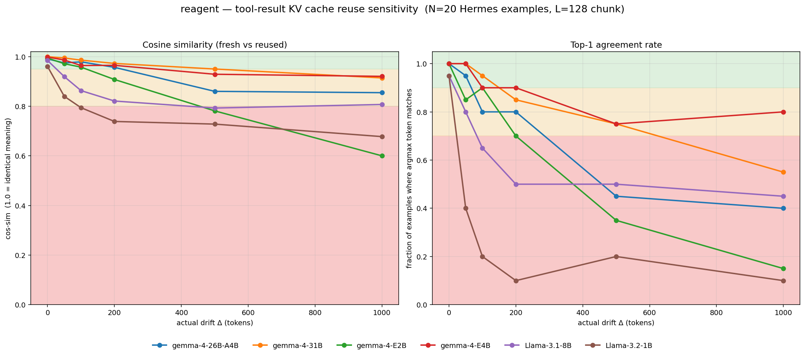

# reagent — tool-result KV cache reuse sensitivity

**reagent** measures whether server-side KV cache reuse preserves
task behaviour when the cached block appears at a drifted absolute
position in a new request. It targets the *read/consumption* step of
cross-request cache reuse — the splice-the-cached-K-into-the-new-prefix
path — and compares two strategies at that step: *naive* (splice with
original RoPE phases) and *shifted* (re-rotate K to the new positions,
matching llama.cpp's `llama_memory_seq_add`).

## Scope

- **Cached blocks are semantically aligned.** We cache the last
  `L=128` tokens of a Hermes tool-result turn — a long, self-contained,
  deterministic block at a clean structural edge. This is the best-case
  input to the splice path.
- **The read path is the same across cache policies.** Whether a server
  caches only whole semantic units (hypothetical "semantic caching") or
  any contiguous N+ token span (llama.cpp's `--cache-reuse`), the
  consumption step is identical: greedy byte-exact match → overwrite
  K/V slots → continue decoding. The two policies differ only in what
  enters the cache; once a match is found, the splice mechanism we
  measure is shared.
- **Cache policy is server-side.** The client sends the prompt; what
  recurs and what matches is decided by the server. Reagent measures a
  serving-stack property, not an agent-framework property.
- What we **do not** test yet: length-based caching that can match
  arbitrary interior spans (fragments that cross turn boundaries,
  non-structural subsequences). See "Future directions".

## What we are testing

Agent servers would like to cache tool results (file contents,
retrieved documents, API responses) and splice the cached KV into
later requests where the same content recurs. The problem is
positional: the cached tensor has RoPE phases baked for the tokens'
original absolute positions, and the model might produce different
next-token predictions when those phases don't match the current
layout.

The experiment sets the chunk at two different positions in
otherwise-equivalent prompts, runs the forward *with* and *without*
reuse, and compares the resulting next-token distributions plus the
subsequent 64-token greedy continuations. If the reused variant is
indistinguishable from a fresh forward, naive cache reuse is safe for
that model at that drift. If it's not, the model needs a correction
scheme (boundary recompute, re-prefill, or skipping reuse past a
threshold).

## Scenario

An agent request typically looks like
`[system][user][assistant: tool_call][tool: tool_result]`, ending
right before the model decodes the next assistant turn. The **tool
result** is the largest, most cache-worthy chunk — hundreds to
thousands of tokens of agent-pasted content the server had to prefill
but never generated.

Across requests, the same tool result may appear at different absolute
positions because the system prompt gained a tool definition, or an
earlier turn was rewritten, or a prior summary was injected. The
serving stack wants to skip re-prefilling that chunk; the question is
whether doing so silently degrades the response.

## Protocol

1. Take a real agent trace from `NousResearch/hermes-function-calling-v1`
   (`func_calling` config). Render it through the model's chat
   template with `add_generation_prompt=True` so the prompt ends at
   the position the model is about to decode from.
2. Run a full in-context prefill of the baseline prompt and snapshot
   the last `L = 128` tokens of the tool-result turn's KV. That's the
   **baseline cached chunk**.
3. Build a **drifted prompt** by appending verbatim copies of the
   system prompt's own content until the rendered length has grown
   by ≥ Δ tokens. Same instructions, same tools — semantically
   redundant, so the model's expected output is unchanged and any
   divergence is attributable to position.
4. For each Δ ∈ {0, 50, 100, 200, 500, 1000}, run two forwards:
   - **Fresh**: prefill the drifted prompt end-to-end, record the
     next-token distribution and greedy-decode 64 more tokens.
   - **Reused**: prefill the drifted prompt up to the chunk, overwrite
     the last `L` KV entries per layer in place with the baseline
     cached chunk, forward the remaining suffix with explicit
     `cache_position` so the trigger token's RoPE phase is correct,
     record the distribution and greedy-decode 64 more tokens.
5. Aggregate over N=20 examples.

## Metrics

| Metric | What it answers |
|---|---|
| `mean_kl ± stdev_kl` | KL(fresh ∥ reused) on the first generated token, in nats. |
| `agree_rate` | Fraction of examples where fresh and reused pick the same top-1 token. |
| `mean_sim_fresh_reused` | Cosine similarity of sentence-embedded (`bge-small-en-v1.5`) fresh and reused continuations. **Headline**: does reuse change what the agent says? |
| `mean_sim_reused_reference` | Cosine similarity of the reused continuation against the dataset's gold assistant reply. Tracks whether reuse degrades task quality, not just self-consistency. |
| `mean_fresh_entropy` | Entropy of the fresh distribution. Values near zero mean the trigger is near-deterministic; the KL column has limited dynamic range there. |
| `mean_actual_delta` | Achieved token drift. Δ targets are floors; inflation may overshoot. |

**KL scale** (nats, log-e): near zero = indistinguishable; ~1 =
sampling would frequently diverge; ≥ 5 = the distributions disagree
on almost everything.

**Cosine-similarity scale** (under `bge-small-en-v1.5`, matching the
green / yellow / red bands in the figure): ≥ 0.95 = same answer
(green); 0.80–0.95 = same topic, rewording (yellow); < 0.80 =
different content or meaning (red).

## Results

N = 20 Hermes examples, L = 128, `bge-small-en-v1.5` embedder,
drift-mode = `system-duplicate`.



Dashed lines = naive reuse (splice cached K/V without correction);
solid lines = shifted reuse (re-rotate K by the position delta before
splicing, matching llama.cpp's `llama_memory_seq_add`). Coloured bands
come from the Passing Bar thresholds.

### sim(fresh, reused) — headline (naive → shifted)

Semantic similarity between the greedy continuation produced without
reuse and with reuse. ≥ 0.95 (green) means reuse is
indistinguishable from fresh; 0.80–0.95 (yellow) means same topic
but rewording; < 0.80 (red) means reuse rewrites the answer.

| model | Δ=0 | Δ=50 | Δ=100 | Δ=200 | Δ=500 | Δ=1000 |
|---|---|---|---|---|---|---|
| `gemma-4-E4B` | 1.00→1.00 | 0.99→0.99 | 0.96→1.00 | 0.96→0.99 | 0.93→0.99 | 0.92→0.99 |
| `gemma-4-31B` | 1.00→1.00 | 0.99→1.00 | 0.99→0.99 | 0.97→0.99 | 0.95→0.98 | 0.91→0.98 |
| `gemma-4-26B-A4B` | 0.99→0.99 | 0.97→0.98 | 0.98→0.98 | 0.96→0.99 | 0.86→0.98 | 0.85→0.99 |
| `Llama-3.1-8B` | 0.98→0.98 | 0.92→0.95 | 0.86→0.94 | 0.82→0.94 | 0.79→0.97 | 0.81→0.96 |
| `gemma-4-E2B` | 0.99→0.99 | 0.97→0.99 | 0.96→0.98 | 0.91→0.99 | 0.78→0.98 | 0.60→**0.99** |
| `Llama-3.2-1B` | 0.96→0.96 | 0.84→0.95 | 0.79→0.95 | 0.74→0.96 | 0.73→0.97 | 0.68→**0.95** |

Shifted reuse lifts every model to ≥ 0.94 sim across the whole
drift range. The worst naive regressions (E2B at Δ=1000: 0.60;
Llama-3.2-1B at Δ=1000: 0.68) recover to 0.99 and 0.95. The phase
error is essentially the whole story at this block type.

### top-1 agreement (naive → shifted)

Fraction of examples where fresh and reused produce the same argmax
token at the trigger position. Stricter metric than sim — first-token
disagreement can be papered over by greedy decoding, so top-1 drops
faster than sim even when the final text converges.

| model | Δ=0 | Δ=50 | Δ=100 | Δ=200 | Δ=500 | Δ=1000 |
|---|---|---|---|---|---|---|
| `gemma-4-E4B` | 1.00→1.00 | 1.00→1.00 | 0.90→1.00 | 0.90→0.95 | 0.75→1.00 | 0.80→1.00 |
| `gemma-4-31B` | 1.00→1.00 | 1.00→1.00 | 0.95→0.95 | 0.85→0.90 | 0.75→0.95 | 0.55→0.95 |
| `gemma-4-26B-A4B` | 1.00→1.00 | 0.95→0.95 | 0.80→0.90 | 0.80→1.00 | 0.45→0.90 | 0.40→1.00 |
| `Llama-3.1-8B` | 0.95→0.95 | 0.80→0.90 | 0.65→0.75 | 0.50→0.85 | 0.50→0.85 | 0.45→0.85 |
| `gemma-4-E2B` | 1.00→1.00 | 0.85→0.90 | 0.90→0.95 | 0.70→1.00 | 0.35→0.95 | 0.15→**1.00** |
| `Llama-3.2-1B` | 0.95→0.95 | 0.40→0.95 | 0.20→0.90 | 0.10→0.90 | 0.20→0.90 | 0.10→**0.85** |

### How to read the tables

- **Δ=0** is the sanity floor. Non-zero KL here means a harness bug,
  not a model insight. At Δ=0 both naive and shifted should produce
  identical output — the shift is 0, so `shift_k_rope` is a no-op.
- **`sim(fresh, reused)`** is the headline. ≥ 0.95 (green) means
  reuse is indistinguishable; 0.80–0.95 (yellow) means same topic
  but rewording; < 0.80 (red) means reuse rewrites the answer.
- **Agreement vs similarity diverge.** Top-1 agreement drops fast
  even for the best-naive models (Llama-3.2-1B at Δ=1000 naive: 10%
  agreement, 68% sim), while sim stays higher because greedy decoding
  routes back to a semantically-equivalent continuation. Shifted
  pulls both metrics into the green zone simultaneously.

### Additional stress test: prior-tool-exchange (E4B)

Under drift-mode `prior-tool-exchange`, the drifted request has a
complete donor `[user → asst(tool_call) → tool]` exchange spliced
between the `system` and the original `user`. Unlike
`system-duplicate` (which inflates with semantically-null copies of
the system prompt), this introduces genuinely different content
between cache-write and cache-read, so the cached chunk's
attention-encoded neighbours are no longer the same. This exposes
the *context-conditioning* error that RoPE shift alone cannot fix.

E4B, N=20, drifts `{0, 500, 1000, 2000, 5000}`:

| Δ | naive sim | shifted sim | Δsim | naive KL | shifted KL |
|---|---|---|---|---|---|
| 0 | 1.00 | 1.00 | +0.00 | 0.00 | 0.00 |
| 500 | 0.94 | 0.96 | +0.02 | 0.60 | 0.06 |
| 1000 | 0.90 | 0.94 | +0.03 | 0.57 | 0.14 |
| 2000 | **0.74** | **0.94** | **+0.21** | 2.67 | 0.18 |
| 5000 | 0.84 | 0.94 | +0.10 | 1.79 | 0.28 |

Shift correction flattens the naive curve (which dips to 0.74 at
Δ=2000) to ~0.94 across all drifts. But the ceiling is ~0.94, not
~0.99 like system-duplicate — the ≈5% gap is the context-conditioning
residual: the cached K vectors encode attention back to their
original neighbours, which are not present in the drifted request.
Shift corrects positions; it cannot reconstruct the referents. The
magnitude is small on this dataset because a tool-result's K is
mostly internally self-referential, but it is present and
non-zero.

### Multi-segment shifted reuse on real same-codebase agent traces

The canonical harness splices ONE cached chunk into a drifted prompt.
A gap-stitching serving engine would face something harder: multiple
byte-exact matches scattered through the new prompt, each with its
own position delta, with native-prefilled gap tokens in between (see
`trace_analysis/`). `measure_multi_splice.py` implements the
post-prefill-overwrite scheme (Scheme A): prefill the new request up
to the last match end; overwrite each matched span's K (RoPE-shifted
by that span's delta) and V with the cached copy; forward the tail
and compare to a fully-fresh forward.

Llama-3.2-1B-Instruct, django SWE-smith trajectories, N=10 sessions,
min-match 128, 45 ordered (A, B) pairs:

| metric | value |
|---|---|
| matches/pair | mean 1.8, max 7 |
| coverage | mean 4%, p90 6%, max 22% |
| longest match | max 1136 tok |
| KL(fresh ‖ reused) | mean 0.02, median 0.00, p90 0.02 |
| sim(fresh, reused) | mean **0.97**, median **1.00**, p10 0.91 |
| top-1 agree | 44/45 |

Per-pair quality distribution:

| bucket | pairs | share |
|---|---|---|
| sim = 1.00 (bit-exact generation) | 30 | 67% |
| 0.95 ≤ sim < 1.00 | 6 | 13% |
| 0.80 ≤ sim < 0.95 | 7 | 16% |
| sim < 0.80 | 2 | 4% |

Multi-segment shifted splice is approximately lossless on two thirds
of pairs and acceptable (sim ≥ 0.95) on ~80%. The ~20% degradation
tail is the same context-conditioning failure mode the single-chunk
`prior-tool-exchange` stress test exposes (shift corrects RoPE phase
but cannot reconstruct the neighbouring-token referents that the
cached K vectors point into). Two observations worth noting:

1. **Volume is not the dominant risk.** The best pair in the run
   (7 matches, 22% coverage, longest 1136 tok) produced sim = 1.00.
   The worst pairs (sim 0.71, 0.80) had only 1–2 short matches at
   low coverage. The number of splices is not what breaks
   generation; *where* they sit relative to the generation prompt is.
2. **Failures cluster at short splices near the tail.** When the
   only match is a short chunk just before the generation prompt and
   the surrounding context differs across sessions, the shifted
   chunk drags the continuation off track. The main-panel
   single-chunk curves predict the same shape.

The upshot: on same-codebase agent workloads a gap-stitching engine
that commits shifted multi-splice blindly would get bit-identical
generations ~67% of the time, acceptable ones ~80%, and noticeably
degrade ~5%. With a gate that rejects splices where the surrounding
context diverges most (heuristic: short match + short tail + low
longest-match fraction), most of the trace-analysis-reported ~29%
per-turn coverage is safely reachable.

#### Gemma-4 E4B vs Llama-3.2-1B head-to-head

`google/gemma-4-E4B-it`, same django SWE-smith dataset, N=5 sessions
(10 ordered pairs), `device_map="balanced"` across 4×A10G:

| metric | Llama-3.2-1B (45 pairs) | Gemma-4 E4B (10 pairs) |
|---|---|---|
| sim(fresh, reused) mean | 0.97 | **0.997** |
| sim(fresh, reused) median | 1.00 | 1.00 |
| sim(fresh, reused) min | **0.71** | **0.978** |
| sim ≥ 0.95 | 80% | **100%** |
| top-1 agree | 44/45 | 10/10 |
| KL mean | 0.02 | 0.001 |

On the five (a, b) pairs that overlap between the two runs and that
Llama-1B failed (sim < 0.95), Gemma-4 produces:

| pair | Llama-1B sim | Gemma-4 sim |
|---|---|---|
| django-money → django-money | 0.905 | **0.978** |
| django-money → daphne (1) | 0.709 | **1.000** |
| django-money → daphne (2) | 0.795 | **1.000** |
| django-money → daphne (3) | 0.878 | **1.000** |
| channels → daphne | 0.875 | **1.000** |

**Multi-segment shifted reuse is *more* tolerant on Gemma-4, not
less.** Hypothesis: the hybrid (sliding + full) attention pattern
limits how far the splice's context-conditioning error can propagate
— sliding layers only see the last 511 tokens, so the corrupted
attention-back-references in a short splice are bounded; full layers
get full context but make up only 4 of every 6 layers (and only on
the non-shared half). Combined with 2 KV heads (vs 8 on Llama-1B),
the per-token attention surface where shift errors can compound is
substantially smaller. Worth re-testing on a denser-attention model
(e.g. Llama-3.1-8B) to confirm direction before generalising.

#### Stabilising Gemma-4 multi-GPU

`device_map="balanced"` triggered an illegal memory access on the
first multi-splice attempt. Root cause: the prefill kernels are
async and may still be writing to per-layer K/V on cuda:N when the
host runs `del out; torch.cuda.empty_cache()` — `empty_cache`
reclaims memory the in-flight kernels were targeting, leaving stale
pointers that surface on the next CUDA op (the layer-5 read in our
case, but it could surface anywhere). Fix in
`measure_multi_splice.py`:
synchronise every visible CUDA device immediately after each
`model()` returns, *before* any teardown; drop the racing
`empty_cache` from the hot path; sync each layer's GPU before
slicing its cache. Llama path is unchanged (no sliding cache, no
contention).

### Drift magnitudes

| Δ | Realistic analogue |
|---|---|
| 0 | identical prompts — sanity check |
| 100 | slightly longer system prompt |
| 500 | extra earlier exchange, or system prompt doubled |
| 1000 | conversation grew significantly, or system prompt tripled |

### Passing bar

A reuse setup is safe at a given drift when mean KL < ~1 nat, stdev
small relative to the mean, top-1 agree ≥ 0.9, and
`sim(fresh, reused)` ≥ 0.95. Under **naive** reuse, no model in our
panel meets that bar past Δ=50; large Gemma-4 variants degrade
gracefully but still fall below 0.95 sim and 0.9 agreement by
Δ=500. Under **shifted** reuse every model in the panel meets the
bar across the entire drift range on `system-duplicate`. Shifted is
the production-correctness baseline; naive is a strawman that should
never ship.

## Running

### Prerequisite: `uv`

All scripts here are [PEP 723 inline-dependency](https://peps.python.org/pep-0723/)
Python files executed via `uv run --script`, so `uv` is the only thing
you need to install once:

```bash
curl -LsSf https://astral.sh/uv/install.sh | sh     # Linux / macOS
# or https://docs.astral.sh/uv/getting-started/installation/ for Windows
```

Everything else (torch, transformers, sentence-transformers, …) is
pinned inline in each script's header and is pulled into a cached
per-script virtualenv by `uv` automatically on first invocation.

### Commands

```bash
./run.sh                             # full panel
MODELS="meta-llama/Llama-3.2-1B-Instruct" \
    ./run.sh                         # single model
N_EXAMPLES=10 ./run.sh               # faster, noisier
FORCE=1 ./run.sh                     # re-run models with existing JSON
```

The wrapper calls `measure_reuse_drift.py` via `uv run --script`, skips
models that already have a non-empty `results/<model>.json`
(unless `FORCE=1`), and ends with a per-drift comparison table. Each
model writes a JSON with both aggregated statistics and per-example
rows.

`measure_reuse_drift.py` takes `--reuse-mode {naive, shifted}`
(default `naive`) and `--drift-mode {system-duplicate,
system-instructions, turn-insert, prior-tool-exchange}` (default
`system-duplicate`). Combine them to explore the matrix directly:

```bash
# shifted on the canonical drift mode
uv run --script measure_reuse_drift.py --model ... --reuse-mode shifted ...

# harder drift mode with real content between cache-write and cache-read
uv run --script measure_reuse_drift.py --model ... --drift-mode prior-tool-exchange ...
```

`visualize.py` renders a 2-panel figure (`sim(fresh, reused)` and
top-1 agreement) from the `results/` JSONs. It includes only the
`system-duplicate` runs (the other drift modes use different Δ
schedules and live outside the core panel) and draws naive as dashed
lines and shifted as solid lines, in matching colours per model, on
the green / yellow / red safety bands from the Passing Bar
thresholds.

Multi-segment shifted reuse (the gap-stitching experiment from
the Results section) is run separately:

```bash
uv run --script measure_multi_splice.py \
    --model meta-llama/Llama-3.2-1B-Instruct \
    --repo django --n-sessions 10 --min-match 128 \
    --output results/multi_splice_django_llama1b.json
```

`measure_multi_splice.py` loads SWE-smith trajectories filtered by
repo prefix, finds every byte-exact ≥ `--min-match`-token span
between each ordered pair of sessions (A, B), and per pair overwrites
B's prefill cache with A's shifted K/V at each match, then compares
the tail generation against a fully-fresh B forward. Results append
to a `.jsonl` sidecar so a crashed run can resume from where it
stopped.

The `drift_modes` and `kv_cache` modules are unit-tested with pytest:

```bash
./test_drift_modes.py    # 59 parametrized tests, ~0.1 s
./test_kv_cache.py       # 5 tests covering write_kv_span routing
```

## Contributing

If you plan to push changes, install the pre-commit hook once per
clone:

```bash
bash scripts/setup.sh
```

The script double-checks `uv` is on your PATH, warms the `uvx ruff`
cache, and symlinks `scripts/pre-commit` into the repo's
`.git/hooks/`. Every commit thereafter runs `uvx ruff format` and
`uvx ruff check --fix` on staged Python files and re-stages the
result. No additional dependencies — the hook uses ephemeral
`uvx`-managed envs.

## Relation to CacheSlide

[CacheSlide (USENIX FAST '26)](https://www.usenix.org/system/files/fast26-liu-yang.pdf)
introduces the phase-drift bound (§3.3), the layer-wise amplification
result (§5.3), and a production reuse policy based on boundary-token
recompute (§1.4). We borrow the core measurement idea — KL on the
next-token distribution as a function of Δ — but make two corrections
for agent-era serving:

1. **In-context baseline.** CacheSlide extracts the cached chunk from
   a prefill of the chunk alone. That conflates position drift with
   "chunk-alone vs chunk-in-context" drift. We baseline from a full
   in-context prefill of the real agent conversation.
2. **Semantically valid drift.** Common shift methods (truncating
   earlier turns, inserting unrelated content) either produce
   malformed conversations or change the model's expected output,
   muddying the measurement. We shift only by duplicating the system
   prompt's own content — redundant by construction — so the model's
   expected reply is unchanged and any divergence is attributable to
   position.

## Data

`NousResearch/hermes-function-calling-v1`, `func_calling` config.
Multi-turn agent traces with a system prompt defining tools, a user
question, an assistant tool call, and a tool-result turn (mean ≈ 400
tokens — comfortably larger than our 128-token cache chunk). We take
the first 20 examples that pass a minimum-length filter; each is
measured independently and the aggregate is reported.

## Future directions

- **Length-based cache reuse.** llama.cpp's `--cache-reuse N` greedily
  finds any N+ token byte-exact match regardless of structural
  alignment. At low N this splices fragments that cross turn
  boundaries or sit mid-paragraph — K vectors whose attention was
  conditioned on context that is *not* present in the new request.
  Our harness always caches a semantically-aligned slice, so this
  failure mode is out of scope. Testing it would mean adding a
  harness setting that picks arbitrary interior cache boundaries
  (e.g. spans that cross the `assistant(tool_call) → tool(result)`
  boundary) and rerunning the naive/shifted comparison.
- **Small cache chunks.** As `L` shrinks, a larger fraction of the
  cached K vectors attend to pre-block tokens rather than to other
  block-internal tokens. Shift correction handles positions but
  cannot repair attention to a different external neighbourhood, so
  the shifted-reuse ceiling is expected to drop below the near-1.00
  level we see at `L=128`.
- **Non-agentic cached content.** Retrieved documents in RAG, source
  code chunks, long user-pasted files. Same splice mechanism but
  different attention-conditioning profiles; worth replicating on a
  non-Hermes dataset.
- **Cache-hit frequency in real agent traces** (addressed by
  [`trace_analysis/`](trace_analysis/)). A pure data-analytical
  companion to the correctness measurement: how much of a real
  request can be byte-matched against earlier requests, and is the
  match contiguous (llama.cpp's prefix-plus-slide can exploit it) or
  fragmented (only gap-stitching could)? Initial findings: on
  repo-grouped workloads (SWE-smith django, Claude Code on
  hyperswitch) coverage averages ~29% with ~4 distinct match
  fragments per request, and the "gap" (coverage minus longest
  contiguous match) is ~13–14% — real upside that current engines
  leave on the table.
- **Multi-segment and accumulated reuse.** Our measurement is
  single-shot: one request's splice in isolation. Two extensions,
  both requiring the harness to move closer to a real serving loop:
  *(a) multi-segment in one request* — splice multiple disjoint
  cached chunks into a single prompt with re-prefilled gaps between
  them, each chunk shifted to its new position. Chunk B's K vectors
  now sit in a context where both their original neighbours *and*
  chunk A's attention-state are wrong. Does per-chunk error add,
  multiply, or saturate? *(b) accumulated reuse across many turns*
  — the same cached chunk read and re-transplanted across N
  sequential turns. If errors compound, a setup that is lossless at
  N=1 may not be at N=10.
